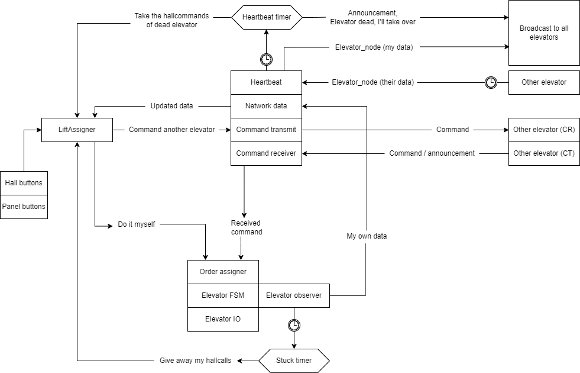

Elevator Project
================
Welcome to our Elevator Project.

## Starting up
Before starting up, make sure that the contents of `config/config.go` matches your setup. 
- `NUMBER_OF_ELEVATORS` must equal the number of elevators in the network. This is not hard coded, it is simply necessary for the memory and asset allocation, this should equal the maximum numbers of elevators on the network. 
- Also make sure that the 3 required network ports in `config/config.go` are unoccupied by other processes.   
- Run the program by typing: `go run main.go --ID *ID of the elevator*` in a terminal within the project folder. 

## About
- Method of communication: Broadcasting over UDP
- Communicational hierarky: Peer-to-peer

A peer-to-peer system with the elevator who had its hallcall panel pushed being responsible for the most effective execusion of said task, it may take it itself or
command another elevator to handle said hallcall. 

All elevators are periodically broadcasting a heartbeat message containing information about their health, where they are, where they are going and what hallcalls
they are currently serving. If an elevator gets stuck, or for some reason cannot perform their own hallcalls anymore it will attempt to redistribute them. And if an elevator becomes unreachable, this will be discovered by the heartbeat functionality when a timer runs out, and the elevator who made the discovery will try to redistribute the hallcalls of the unreachable elevator, and also alert all other elevators. The elevators has an asynchronous heartbeat timeout time based on their ID so that only one elevator will try to revive the hallcalls of an unreachable elevator. 
Cab calls are being saved to a .json file, that is read on startup in case of a primature shutdown. This way, no calls are ever lost.

The ordering package is responsible for effective execution of said elevator requests. It does this by calculating a score to find out which elevator who can perform the task the most efficiently. The scoring algorithm takes this into account
- Position
- Direction
- Number of hallcalls 

There is also some functionality that will kill the program if a deadlock is detected
### Topological overview

The Task
========
Create software for controlling `n` elevators working in parallel across `m` floors.

Be reasonable: There may be semantic hoops that you can jump through to create something that is "technically correct". Do not hesitate to contact us if you feel that something is ambiguous or missing from these requirements.

Main requirements
-----------------

### The button lights are a service guarantee
 - Once the light on a hall call button (buttons for calling an elevator to that floor; top 6 buttons on the control panel) is turned on, an elevator should arrive at that floor
 - Similarly for a call (for telling the elevator what floor you want to exit at; front 4 buttons on the control panel), but only the elevator at that specific workspace should take the order

### No calls are lost
 - Failure states are anything that prevents the elevator from communicating with other elevators or servicing calls
   - This includes losing network connection entirely, software that crashes, doors that won't close, and losing power - both to the elevator motor and the machine that controls the elevator
   - Network packet loss is not a failure, and can occur at any time
   - An elevator entering the network is not a failure
 - No calls should be lost in the presence of failures
   - For cab calls, handling loss of power or software crash implies that the calls are executed once service to that elevator is restored
   - The time used to handle (compensate for) these failures should be reasonable, i.e. on the order of magnitude of seconds (not minutes)
 - If the elevator is disconnected from the network, it should still serve all the currently active calls (i.e. whatever lights are showing)
   - It should also keep taking new cab calls, so that people can exit the elevator even if it is disconnected from the network
   - The elevator software should not require reinitialization (manual restart) after intermittent network or motor power loss

### The lights and buttons should function as expected
 - The hall call buttons on all workspaces should let you summon an elevator
 - Under normal circumstances, the lights on the hall buttons should show the same thing on all workspaces
   - Normal circumstances mean when there are no active failures and no packet loss
   - Under circumstances with packet loss, at least one light must work as expected
 - The cab button lights should not be shared between workspaces
 - The cab and hall button lights should turn on as soon as is reasonable after the button has been pressed
   - Not ever turning on the button lights because "no guarantee is offered" is not a valid solution
   - You are allowed to expect the user to press the button again if it does not light up
 - The cab and hall button lights should turn off when the corresponding call has been serviced

### The door should function as expected
 - The "door open" lamp should be used as a substitute for an actual door
   - The door should not be open (light switched on) while the elevator is moving
   - The duration for keeping the door open when stopping at a floor should be 3 (three) seconds
 - The obstruction switch should substitute the door obstruction sensor inside the elevator
   - The door should not close while it is obstructed
   - The obstruction can trigger (and un-trigger) at any time

### An individual elevator should behave sensibly and efficiently
 - No stopping at every floor "just to be safe"
 - Clearing a hall call button light is assumed to mean that the elevator that arrived at that floor announces "going up" or "going down" to the user (for up and down buttons respectively), and users are assumed to only enter an elevator moving in the direction they have requested
   - This means that a single elevator arriving at a floor should *not* clear both up and down calls simultaneously
   - If the elevator has no reason to travel in the direction it has announced (e.g. a both up and down are requested, but the people entering the elevator all want to go down), the elevator should "announce" that it is changing direction by first clearing the call in the opposite direction, then keeping the door open for another 3 seconds

Secondary requirements
----------------------

*These requirements will only be regarded if the system satisfies the main requirements.*

### Calls should be served as efficiently as possible
 - The calls should be distributed across the elevators in such a way that they are serviced as soon as possible

Permitted assumptions
---------------------

The following assumptions will always be true during testing:
 1. There is always at least one elevator that is not in a failure state
    - I.e. there is always at least one elevator that can serve calls
    - "No failure" includes the door obstruction: At least one elevator will be able to close its doors
 2. Cab call redundancy with a single elevator is not required
    - Given assumption **1**, a system containing only one elevator is assumed to be unable to fail
 3. No network partitioning: There will never be a situation where there are multiple sets of two or more elevators with no connection between them
    - Note that this needs 4 or more elevators to become applicable, which we will not test anyway

Unspecified behavior
--------------------
Some things are left intentionally unspecified. Their implementation will not be tested, and are therefore up to you.

How the elevator behaves when it cannot connect to the network (router) during initialization
 - You can either enter a "single-elevator" mode, or refuse to start

How the hall (call up, call down) buttons work when the elevator is disconnected from the network
 - You can optionally refuse to take these new calls

What the stop button does
 - The stop button functionality (if/when implemented) is up to you

Recommendations
---------------

Start with `1 <= n <= 3` elevators, and `m == 4` floors. Try to avoid hard-coding these values: You should be able to add a fourth elevator with no extra configuration, or change the number of floors with minimal configuration. You do, however, not need to test for `n > 3` and `m != 4`.

If you need to specify the identifier of an elevator when it starts, we recommend that you implement the command-line switch `--id <number>`.

Additional resources
--------------------

Go to [the project resources repository](https://github.com/TTK4145/Project-resources) to find more resources for doing the project. This information is not required for the project, and is therefore maintained separately.

See [Testing from home](/testing_from_home.md) document on how to test with unreliable networking on a single computer.
